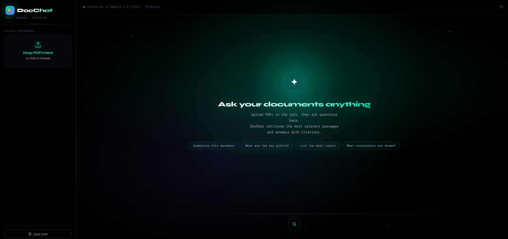
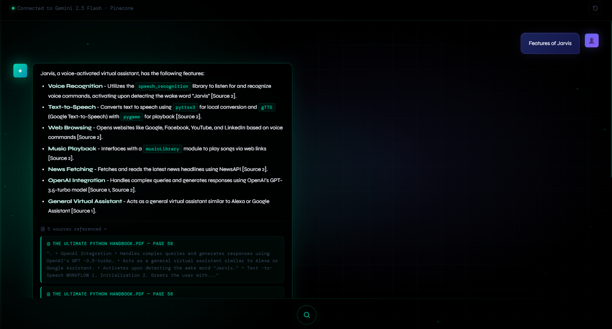

# RAG PDF Chatbot — Full Stack

A full-stack AI-powered document chatbot built with FastAPI and React. Upload any PDF, ask questions in natural language, and get accurate answers with source citations — powered by Gemini embeddings and Pinecone vector search.


---

## 🚀 Demo Preview

### Homepage & Upload


### RAG Response with Source Citations


---

## ✨ Key Highlights

- Built a full-stack RAG (Retrieval-Augmented Generation) system using FastAPI and React
- Integrated Gemini Embedding API to convert PDF chunks into 3072-dimensional semantic vectors
- Implemented vector similarity search using Pinecone to retrieve the most relevant document passages
- Used Gemini 2.5 Flash LLM to generate accurate, context-grounded answers with inline source citations
- Supports both a terminal chatbot mode and a premium web UI — both powered by the same RAG engine
- Designed a dark glassmorphism UI with mouse-interactive aurora glow and floating particle animations

---

## 🎯 Use Cases

- Chat with your resume, research papers, or any PDF document
- Ask follow-up questions with full conversation memory
- Get answers with exact page citations so you can verify the source
- Index multiple PDFs and search across all of them at once

---

## 🧠 Architecture

```
┌─────────────────────────────────────────────────────┐
│                   React Frontend                     │
│        (Drag-drop Upload · Chat UI · Citations)      │
└──────────────────────┬──────────────────────────────┘
                       │ HTTP (POST /upload, POST /query)
┌──────────────────────▼──────────────────────────────┐
│                  FastAPI Backend                     │
│                                                      │
│  ┌──────────────────────────────────────────────┐   │
│  │               rag_engine.py                  │   │
│  │                                              │   │
│  │  PDF bytes                                   │   │
│  │    → pypdf (extract text)                    │   │
│  │    → LangChain RecursiveCharacterTextSplitter│   │
│  │    → Gemini Embedding API (3072 dimensions)  │   │
│  │    → Pinecone (store vectors + metadata)     │   │
│  │                                              │   │
│  │  User question                               │   │
│  │    → Gemini Embedding API (query vector)     │   │
│  │    → Pinecone similarity_search (top 5)      │   │
│  │    → Gemini 2.5 Flash (answer + citations)   │   │
│  └──────────────────────────────────────────────┘   │
└─────────────────────────────────────────────────────┘
```

**Flow:**
- PDF is split into 1000-character overlapping chunks by LangChain
- Each chunk is converted to a 3072-number vector by Gemini Embedding API
- Vectors are stored permanently in Pinecone with file + page metadata
- On a query, the question is embedded and Pinecone finds the top 5 closest chunks using cosine similarity
- The retrieved chunks + question are sent to Gemini 2.5 Flash to generate a grounded answer
- Answer and source citations are returned to the frontend

---

## 📁 Project Structure

```
rag-pdf-chatbot/
│
├── backend/
│   ├── main.py           ← FastAPI server — exposes RAG as HTTP endpoints
│   ├── chat.py           ← Terminal chatbot — run directly without browser
│   ├── rag_engine.py     ← Core RAG logic shared by both main.py and chat.py
│   ├── requirements.txt  ← Python packages
│   ├── .env.example      ← API keys template
│   └── .env              ← Your actual keys (create this, never commit)
│
├── frontend/
│   ├── src/
│   │   ├── components/
│   │   │   ├── Sidebar.jsx   ← Drag-drop PDF upload panel
│   │   │   └── Message.jsx   ← Chat bubble + collapsible source citations
│   │   ├── App.jsx           ← Main app, mouse-interactive aurora background
│   │   ├── api.js            ← Axios calls to FastAPI backend
│   │   ├── main.jsx          ← React entry point
│   │   └── index.css         ← Full design system — glassmorphism, animations
│   ├── index.html
│   ├── package.json
│   └── vite.config.js
│
└── README.md
```

---

## 🛠️ Tech Stack

**Frontend**
- React 18 + Vite
- Custom CSS — dark glassmorphism, mouse-tracking aurora glow, floating particles
- Axios — API calls to backend
- Lucide React — icons

**Backend**
- FastAPI + Uvicorn
- LangChain — RAG pipeline, text splitting, message formatting
- pypdf — PDF text extraction

**AI & Vector Search**
- Gemini Embedding API (`gemini-embedding-001`) — 3072-dimensional semantic embeddings
- Gemini 2.5 Flash — answer generation with source citations
- Pinecone — cloud vector database with cosine similarity search

---

## ⚠️ Python Version — IMPORTANT

This project requires **Python 3.11**. It does NOT work on Python 3.12, 3.13, or 3.14 due to LangChain dependency compatibility issues.

### Check your Python version

```bash
python --version
```

If it shows `3.11.x` you are good. If it shows anything else, follow these steps:

### Check if Python 3.11 is already installed

```bash
py -3.11 --version
```

If it shows `Python 3.11.x` it is already installed — skip to the setup steps below.

### Install Python 3.11 (only if needed)

Download from: https://www.python.org/downloads/release/python-3119/

Scroll to "Files" and download **Windows installer (64-bit)**.
Check **"Add Python to PATH"** during installation.

### Always create venv using Python 3.11

```bash
py -3.11 -m venv venv
```

This forces the virtual environment to use 3.11 regardless of your global default.

> Note: VS Code's status bar may show Python 3.14 — that is the global version, ignore it.
> What matters is `python --version` inside the activated venv showing 3.11.

---

## 🚀 Getting Started

### Prerequisites

- Python 3.11
- Node.js 18+
- Free [Gemini API key](https://aistudio.google.com/app/apikey)
- Free [Pinecone API key](https://app.pinecone.io)

---

## OPTION A — Terminal Mode (no browser needed)

```bash
cd backend

py -3.11 -m venv venv            # Windows
python3.11 -m venv venv          # Mac/Linux

venv\Scripts\Activate.ps1        # Windows PowerShell
source venv/bin/activate         # Mac/Linux

pip install -r requirements.txt

copy .env.example .env           # Windows
cp .env.example .env             # Mac/Linux
```

Fill in your API keys in `.env`, then run:

```bash
python chat.py
```

---

## OPTION B — Full Web UI (FastAPI + React)

Requires **two terminals** open at the same time.

### Terminal 1 — Backend

```bash
cd backend
py -3.11 -m venv venv
venv\Scripts\Activate.ps1
pip install -r requirements.txt
copy .env.example .env           # fill in your keys
uvicorn main:app --reload
```

Backend runs at: **http://localhost:8000**

### Terminal 2 — Frontend

```bash
cd frontend
npm install
npm run dev
```

Frontend runs at: **http://localhost:5173**

Open **http://localhost:5173** in your browser.

**Every time you come back to the project:**
1. Terminal 1 → `cd backend` → `venv\Scripts\Activate.ps1` → `uvicorn main:app --reload`
2. Terminal 2 → `cd frontend` → `npm run dev`
3. Open `http://localhost:5173`

---

## 🖥️ Usage (Web UI)

1. Drag and drop PDF files into the left sidebar
2. Wait for the **"chunks indexed"** confirmation
3. Type your question in the input box and press **Enter**
4. Expand **Sources** under any answer to see exact page citations

---

## 📡 API Endpoints

| Method | Endpoint | Description |
|--------|----------|-------------|
| GET | `/health` | Check if backend is alive |
| POST | `/upload` | Upload and index a PDF file |
| POST | `/query` | Ask a question, returns answer + sources |

---

## 🔑 Environment Variables

Create a `.env` file inside `backend/` with the following:

```
GEMINI_API_KEY=your_gemini_api_key_here
PINECONE_API_KEY=your_pinecone_api_key_here
PINECONE_INDEX_NAME=doc-chatbot
```

| Variable | Description | Get it here |
|----------|-------------|-------------|
| `GEMINI_API_KEY` | Google Gemini API key | https://aistudio.google.com/app/apikey |
| `PINECONE_API_KEY` | Pinecone vector DB key | https://app.pinecone.io |
| `PINECONE_INDEX_NAME` | Name for your Pinecone index | Any name e.g. `doc-chatbot` |

> Never commit your `.env` file — it is already in `.gitignore`

---

## 📝 Notes

- `chat.py` and `main.py` both use the same `rag_engine.py` — the RAG logic is shared
- PDFs stay indexed in Pinecone permanently — no need to re-upload on restart
- Gemini free tier: ~750 questions per day (each question = 2 API calls)
- Pinecone free tier: 100,000 vectors (enough for hundreds of PDFs)
- Always use `py -3.11 -m venv venv` to avoid Python version issues
- The `venv/` and `.env` files are excluded from Git via `.gitignore`
